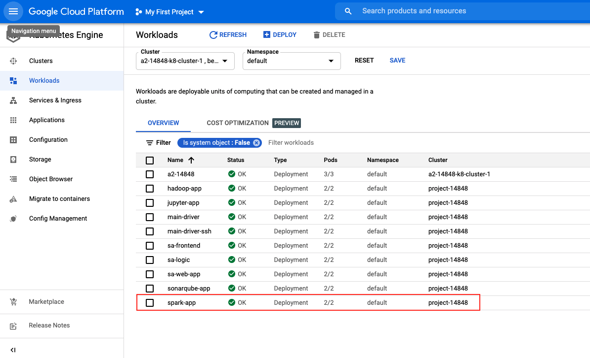
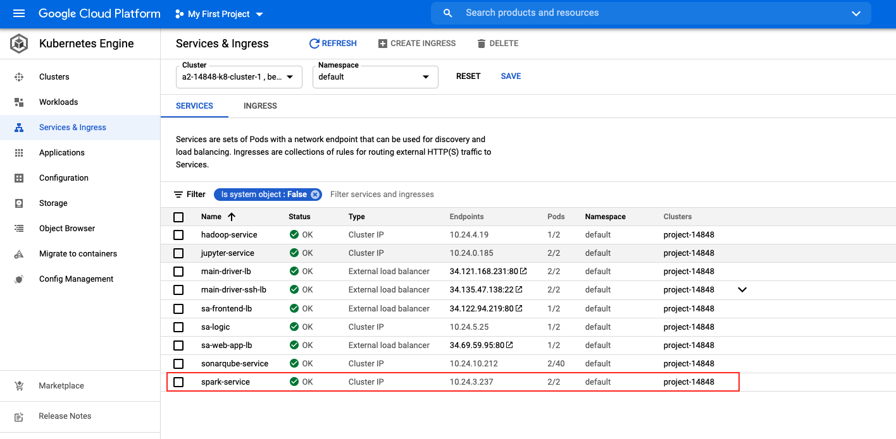

# 14848_cloud_infra_proj_spark

## How to build docker image
- Run `docker build --no-cache --progress=plain -t YOUR_DOCKER_ID/14848_proj_spark . ` and push the image to DockerHub.

## Deploy docker image to Google Cloud Platform Kubernetes Cluster
- Open Cloud Shell on GCP and clone the repository:
```
git clone https://github.com/shihsunl/14848_cloud_infra_proj_spark.git
```
- Modify docker image in `resource-manifests/spark_deployment.yaml`.
- Execute 2 yaml file in resource-manifests folder.
```
cd 14848_cloud_infra_proj_spark/resource-manifests/
kubectl apply -f spark_deployment.yaml
kubectl create -f service-spark.yaml
```
- Then, you can check Workloads and Service & Ingress



- Next, you can access to the Service Website and select the spark service. Please check: `https://github.com/shihsunl/14848_cloud_infra_proj_driver`